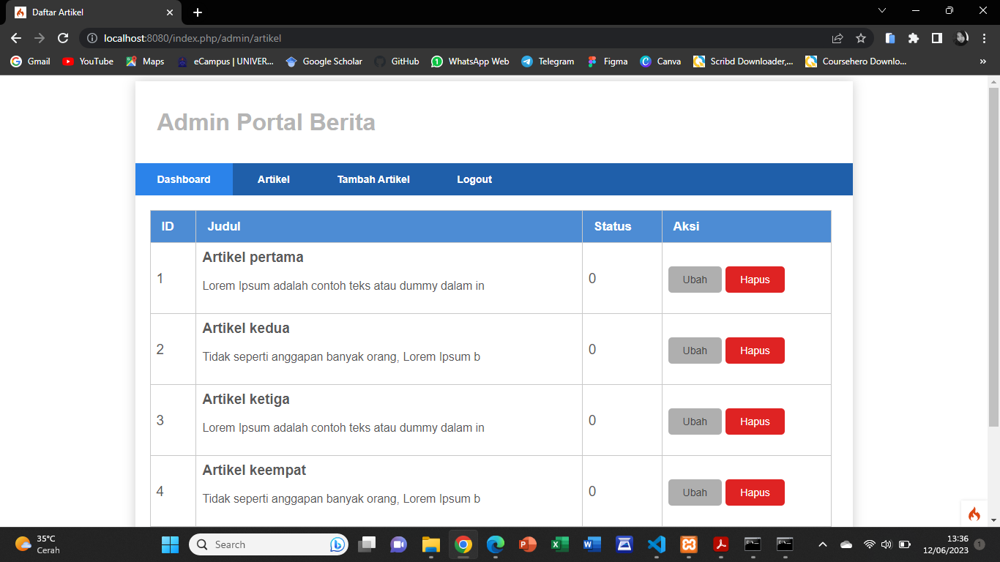
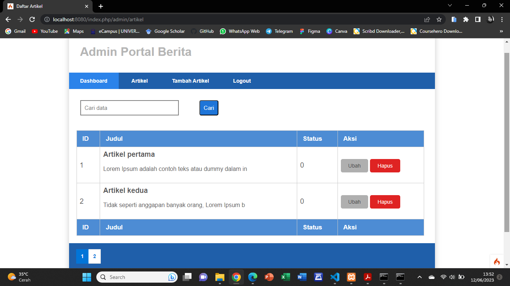
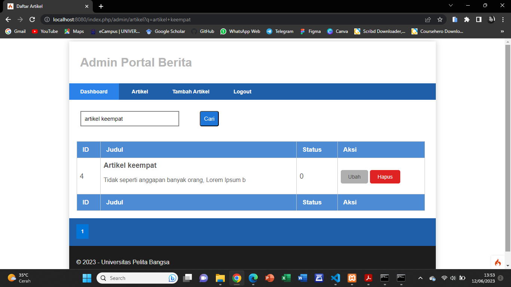

# Praktikum 10 - Pagination dan Pencarian

## Langkah-langkah Praktikum

Pagination merupakan proses yang digunakan untuk membatasi tampilan yang panjang dari data yang banyak pada sebuah website. Fungsi pagination adalah memecah tampilan menjadi beberapa halaman tergantung banyaknya data yang akan ditampilkan pada setiap halaman. Pada Codeigniter 4, fungsi pagination sudah tersedia pada Library sehingga cukup mudah menggunakannya. 

## Membuat Pagination

* Untuk membuat pagination, buka kembali **Controller Artikel**, kemudian modifikasi kode pada method **admin_index** seperti berikut.

    ```php
        public function admin_index()
        {
            $title = 'Daftar Artikel';
            $model = new ArtikelModel();
            $data = [
            'title' => $title,
            'artikel' => $model->paginate(10), #data dibatasi 10 record perhalaman
            'pager' => $model->pager,
            ];
            return view('artikel/admin_index', $data);
        }
    ```

* Kemudian buka file **views/artikel/admin_index.php** dan tambahkan kode berikut dibawah deklarasi tabel data.

    ```php
        <?= $pager->links(); ?>
    ```

* Tambahkan terlebih dahulu CSS di **public/admin.css** untuk mempercantik tampilan pagination.

* Selanjutnya buka kembali menu daftar artikel, tambahkan data lagi untuk melihat hasilnya.




##  Membuat Pencarian

Pencarian data digunakan untuk memfilter data.

* Untuk membuat pencarian data, buka kembali **Controllers Artikel**, pada method **admin_index** ubah kode nya seperti berikut. 

    ```php
        public function admin_index()
        {
	      $title = 'Daftar Artikel';
	      $q = $this->request->getVar('q') ?? '';
	      $model = new ArtikelModel();
	      $data = [
	           'title' => $title,
	           'q' => $q,
	           'artikel' => $model->like('judul', $q)->paginate(2), # data dibatasi 2 record per halaman
	           'pager' => $model->pager,
	         ];
	      return view('artikel/admin_index', $data);
        }
    ```

* Kemudian buka kembali file **views/artikel/admin_index.php** dan tambahkan form pencarian sebelum deklarasi tabel seperti berikut.

    ```html
        <form method="get" class="form-search">
            <input type="text" name="q" value="<?= $q; ?>" placeholder="Cari data">
            <input type="submit" value="Cari" class="btn btn-primary">
        </form>
    ```

* Dan pada link pager ubah seperti berikut.

    ```php
        <?= $pager->only(['q'])->links(); ?>
    ```

* Selanjutnya ujicoba dengan membuka kembali halaman admin artikel.




* Tambahkan CSS pada file **admin.css** untuk mempercantik bagian search. Dan saya akan memasukan kata kunci untuk mencari artikel yang ingin saya cari dipencarian, hasilnya akan seperti dibawah ini.




## Terimakasih!